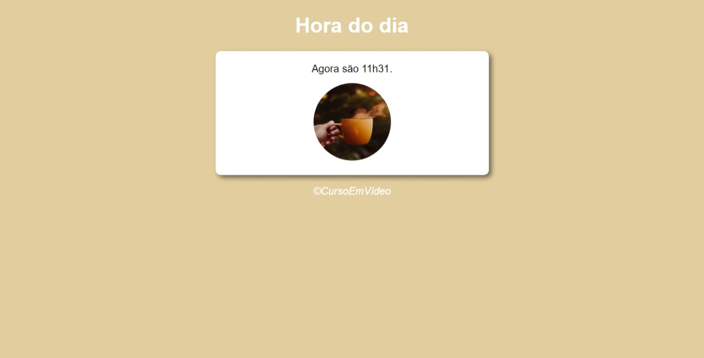

# Curso de Javascript com Gustavo Guanabara

# HORA DO DIA

> Trilha iniciante

Projeto construído a partir do curso Javascript do Curso em Vídeo, com o Gustavo Guanabara.

[🔗 Clique e acesse a página](https://claudiolira.github.io/horadodia/)

## 🛠 Tecnologias

- HTML
- CSS
- JAVASCRIPT
- GIT
- GITHUB

## O que aprendi nesse evento

- O desenvolvimento é natural.
- O importante é aprender pouco a pouco.
- Compartilhar com outras pessoas é uma boa prática.
- Estudar no coletivo é mais produtivo.

## 🙂 Contato

- https://www.linkedin.com/in/liraclaudio/
